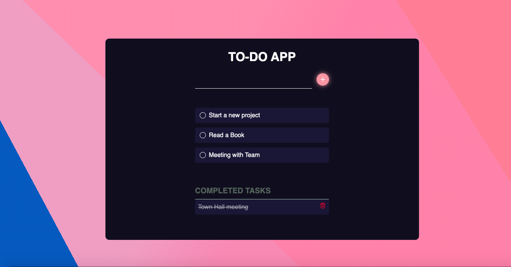

<h1 align="center">TO-DO App</h1>

The TO-DO App is a task management app to help you stay organized and manage your day-to-day. An application specially built to keep track of errands or tasks that need to be done. This application will be like a task keeper where the user would be able to enter the tasks that they need to do. Once they are done with their tasks they can also remove them from the list.

 

 

  
 

